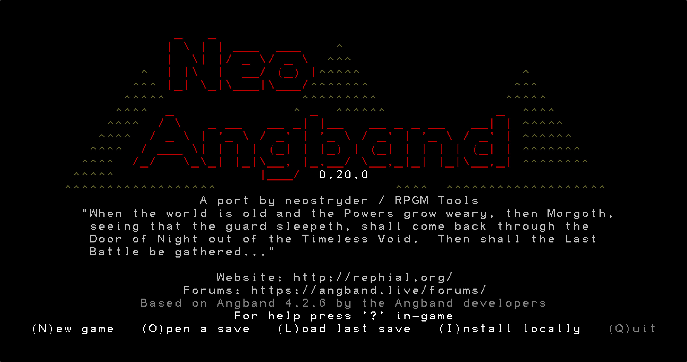
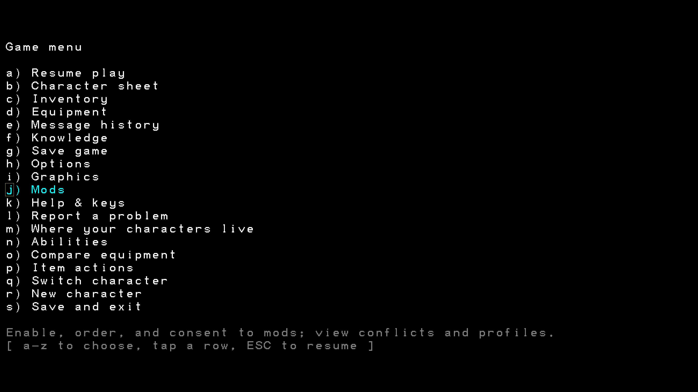
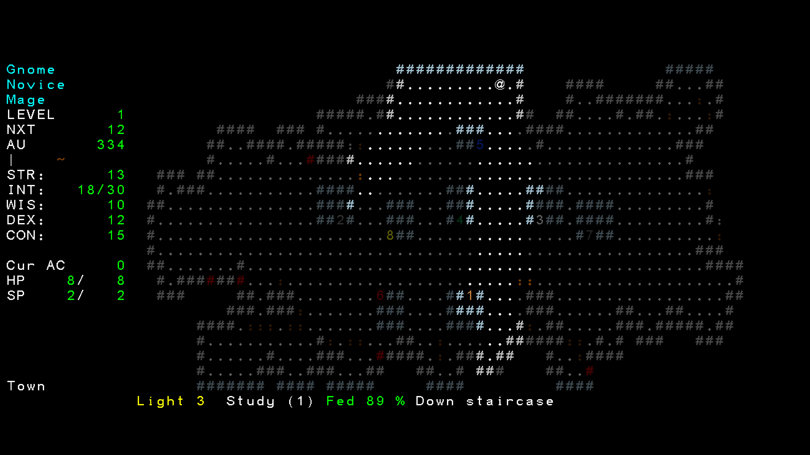
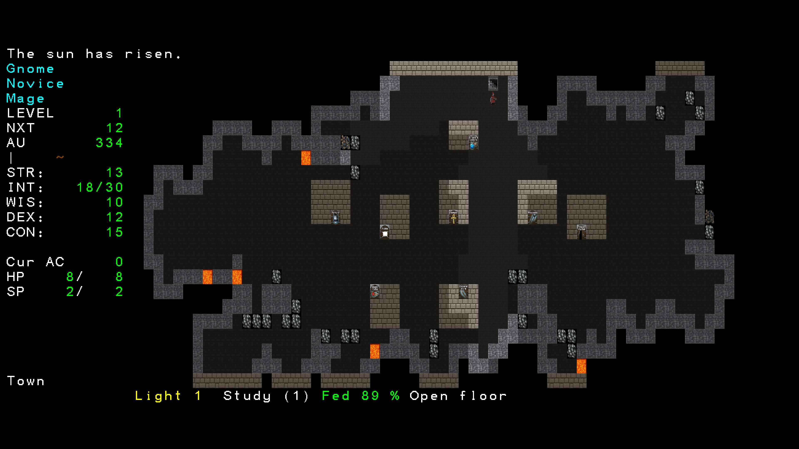
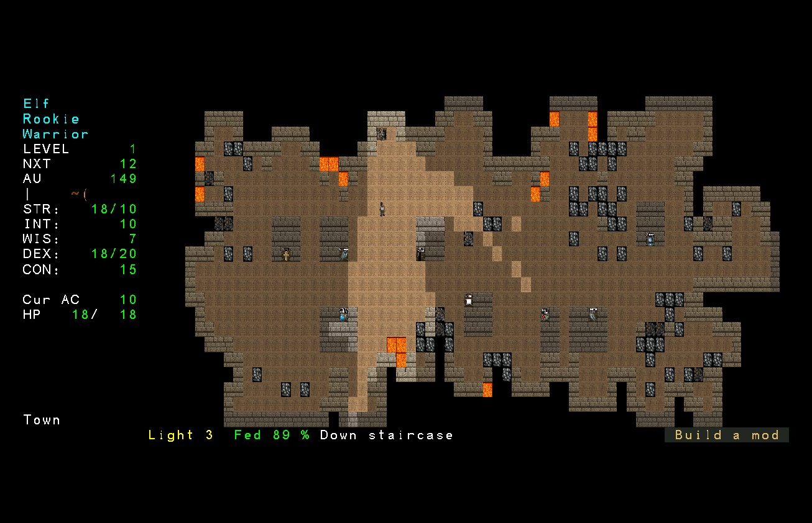
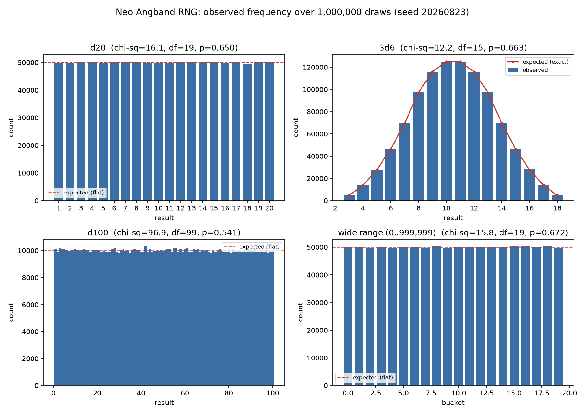
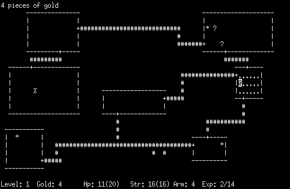
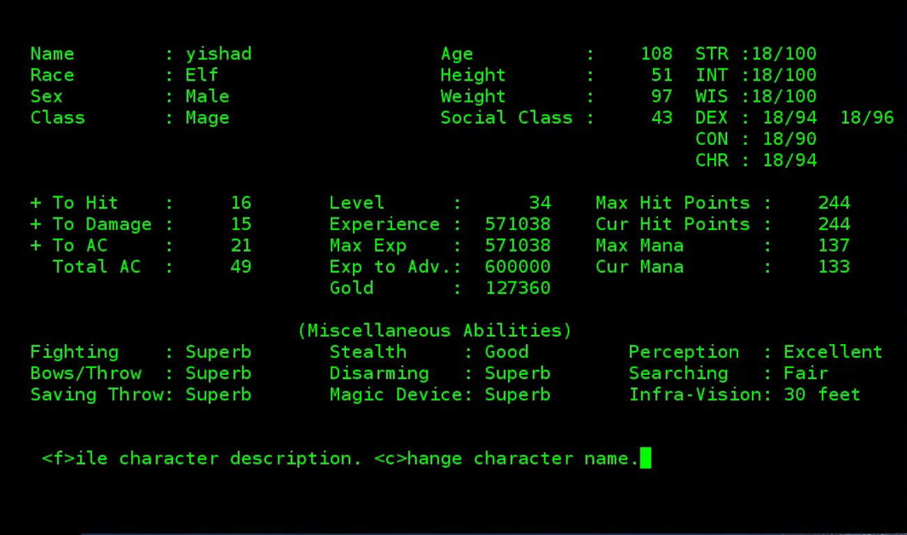
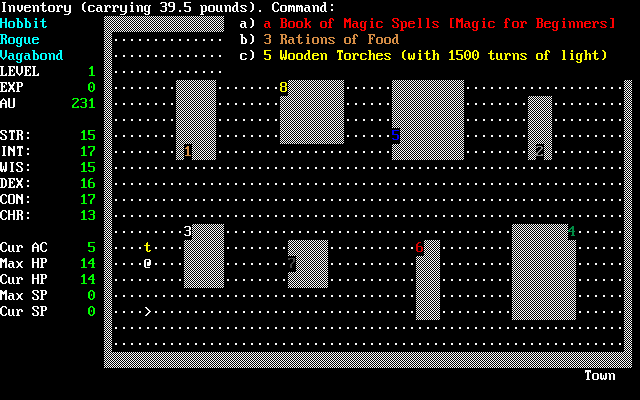

# Neo Angband

**Angband with a modern mod system.**

It is the same game: the latest official release of
[Angband](https://github.com/angband/angband), carefully rebuilt so it runs
anywhere and so you can change it without forking it.

- **Play it in a browser**, or install it as an app, or run a desktop build.
- **Play vanilla.** With no mods on, it is the original game.
- **Add mods** when you want something different.
- **Make your own mods** without maintaining a fork of Angband.

**New here? [The Quick Start Guide](docs/QUICKSTART.md) walks through birth
settings, controls, mods worth turning on, a tour of town, and the first steps
into the dungeon - with real screenshots at every step.**

> ## Try it now: [play in your browser](https://angband.rpgm.world/)
>
> No install, no account, nothing to download. The link opens straight into
> the game, and it keeps your save in that browser.
>
> **Why you might like playing this way:** it is the fastest way there is -
> one click, and you are rolling a character.
>
> That copy tracks the latest **published release**, not master's bleeding
> edge, so it is the same stable build every method below plays, just already
> running:
>
> - **[Download a release](https://github.com/neostryder/neo-angband/releases)**
>   for Windows, macOS or Linux. A file that sits on your machine and does not
>   change until you replace it.
>   **Why you might like playing this way:** you want a copy that stays put,
>   with nothing running in a browser tab.
> - **[Run it from source](#play-it)**, cloned at a commit you chose. About
>   two minutes with Node and pnpm installed.
>   **Why you might like playing this way:** you want a change that has not
>   reached a release yet, or you are chasing a difference from the original
>   and need to name the exact commit that showed it.
> - **[Self-host it as a static site](docs/INSTALL.md#2-self-host-as-a-static-site)**,
>   the same files the browser build serves, on a host you control.
>   **Why you might like playing this way:** you want a copy that only
>   changes when you decide to update it, for yourself or a group.
> - **[Install it as a PWA](docs/INSTALL.md#3-install-as-a-pwa-offline-any-platform)**,
>   which pins the browser build to your device and works with no connection.
>   **Why you might like playing this way:** you want it on a phone or
>   tablet, offline, without an app store.
> - **[Desktop app](docs/INSTALL.md#4-desktop-app-electron)** - the same game
>   in a native window instead of a browser tab.
>   **Why you might like playing this way:** you want it to feel like an
>   installed application rather than a website.

---

> ## A note on the desktop auto-updater
>
> GitHub changed the servers it uses to deliver release downloads, and the
> in-app updater in desktop builds older than 0.34.1 does not recognize the
> new address. If your desktop copy fails to update with a "redirected to an
> unexpected host" error, this is why - it is not specific to your machine or
> install. The updater itself has been fixed since 0.34.1; a copy still
> stuck on an older build needs the one-time manual step below to reach that
> fix, since it runs in the build you install, not the one you already have.
>
> **The quick fix:** download the latest release from
> [the releases page](https://github.com/neostryder/neo-angband/releases) and
> extract it over your existing install folder, the same way you installed it
> the first time. Your save data lives in its own folder next to the game and
> is not touched by this.

---

> ## Status: playable start to finish, and still worth a bug report
>
> Roll a character, shop the town, descend, die permanently - the whole game is
> there. Play sessions still turn up things the automated checks cannot see: a
> message the original prints that this one does not, a screen laid out a
> column off, a prompt that never appears.
>
> **That is exactly what a bug report is for.** Play it, and when something feels
> unlike Angband, [open an issue](https://github.com/neostryder/neo-angband/issues).
> See [reporting a difference](#reporting-a-difference) for the one detail that
> makes a report immediately actionable.

## Why you might want it

**If you just want to play Angband:** it runs in a browser with nothing to
install, it installs as a real app on Windows, macOS and Linux, and it works
offline. Same game, fewer obstacles.

**If you have ever wanted to change something about Angband:** that is the
point of the project. Not *"you can edit the data files"*. Angband has always
let you do that. The difference is that here a change is a **thing you can
hand to someone**: a folder you switch on and off, share, combine with other
people's, and keep working when the game updates.

That runs from *"I miss this one feature"* all the way to *"I want to build the
next ZAngband"*, using the same system for both.

## Screenshots

| | |
|---|---|
|  |  |
|  |  |

Same character, same town, two tile choices - the classic look never goes away,
and a different one is a menu selection away. [Mod
management](docs/img/screenshots/neo-angband-mods.jpg) shows what a mod is
before you decide whether to trust it: what it changes, what it asks for, and
who wrote it.



Nothing above is a mockup - the mod family stays real content running in a real
session. That same session is where [the Borg](https://github.com/neostryder/neo-angband-mod-borg)
takes the keyboard and plays on its own, and where
[ModForge](https://github.com/neostryder/neo-angband-mod-forge) opens a workshop
for building a new mod without leaving the game.

## Play it

**[Download a build](https://github.com/neostryder/neo-angband/releases)** for
Windows, macOS or Linux. The Windows **portable** `.exe` and the Linux
**AppImage** need no installer at all: download, run, and the game keeps its
saves in a folder beside itself.

Those builds are **not code-signed**, so your OS will block the first launch.

- **Windows:** one click, *More info → Run anyway*.
- **macOS:** the dialog you get does **not** contain the way through, so ignore
  it. Open **System Settings → Privacy & Security**, scroll down to
  **Security**, and press **Open Anyway** on the line naming the app.
  [The full steps are here.](docs/INSTALL.md#macos-blocks-it-first-time) On
  Apple Silicon, take the **arm64** build, not the Intel one.
- **Arch Linux:** a bare install is missing the package the AppImage needs to
  run (`pacman -S fuse2`), or take the **`.tar.gz`** build instead, which
  does not need it. [Full details here.](docs/INSTALL.md#arch-linux-and-the-appimage)

If you would rather not make that trade at all, play in a browser, which needs
no trust decision, or build it yourself below.

Or run it from source, which takes about two minutes and is the best way to test:

```bash
git clone https://github.com/neostryder/neo-angband.git
```

```bash
cd neo-angband && pnpm install && pnpm --filter @rpgm-tools/neo-angband-web dev
```

Then open **http://localhost:5178**. You need [Node](https://nodejs.org/) 22+ and
[pnpm](https://pnpm.io/installation) (`corepack enable` gets you pnpm).

**Every other way** (the offline PWA install, self-hosting it as static files,
the desktop app, per-browser notes) is in
**[docs/INSTALL.md](docs/INSTALL.md)**.

### Back your character up

Saves live in your browser's storage, scoped to the address you play on. **Anything
that clears that storage takes every character and every installed mod at once,
with no undo**: "clear browsing data", a cleanup tool like CCleaner or Disk
Cleanup, resetting a browser profile, or deleting the desktop build's
`data` folder. Death is permanent here, so there is nothing to
recover from but a file you exported yourself.

Use the built-in export: **`Shift-X`** on the character list writes a character to
a file, **`Shift-M`** reads one back on any copy of the game. That is both the
backup and the way to move a character between the browser and the desktop app.
The game explains the rest on **Where your characters live** (`Shift-W`).

## Mods

Press `Escape`, choose **Mods**, choose **Install a mod...**, pick one, press
Enter. That is the whole process; nothing needs a folder, an account or a tool.

The game **bundles no mods at all**, not even the author's. Each one lives in its
own repository and installs by the same verified route anybody's would, which is
the only way to know that route actually works.

| Mod | What it is |
| --- | --- |
| [feature-restoration](https://github.com/neostryder/neo-angband-mod-feature-restoration) | Beloved features that later versions of Angband dropped, brought back one switch at a time |
| [qol](https://github.com/neostryder/neo-angband-mod-qol) | Quality-of-life conveniences |
| [bug-fixes](https://github.com/neostryder/neo-angband-mod-bug-fixes) | Fixes for upstream bugs the base game keeps on purpose |
| [neo-linoleum](https://github.com/neostryder/neo-angband-mod-linoleum) | A second tile engine, and all of Angband's tile sets converted to it |
| [borg](https://github.com/neostryder/neo-angband-mod-borg) | An automatic player |
| [forge](https://github.com/neostryder/neo-angband-mod-forge) | An in-game workshop for building a mod from something that already exists |
| [upstream-catchup](https://github.com/neostryder/neo-angband-mod-upstream-catchup) | Changes Angband accepted after the 4.2.6 tag this port is pinned to, each cited to its commit |

**What a mod can do:** change any value in any of the game's data files; add
items, monsters, artifacts and whole new kinds of item; add or retune spells;
change how stores behave; generate its own dungeon levels; ship art, sounds and
fonts; run real code; expose its own settings; and draw the world itself. The
[measured, honest table](docs/modding/README.md#surface-status-complete-wip-not-yet)
of what is built today versus what is not is in the modding docs, including the
parts that are still missing.

**Vanilla stays vanilla.** With no mods enabled, this is the original game. That
is the shared baseline everything else layers on top of, and it is what the
project measures itself against. A game's enabled mods and their versions are
recorded in its diagnostics and in the character dump, so two players can always
tell whether they were playing the same thing.

### Making one

> **Want to make a mod? [Start here.](docs/modding/tutorials/README.md)**
>
> Never made one before? That is fine. The first tutorial takes about five
> minutes, needs nothing but a text editor, and changes the game. Seven
> tutorials in all, each teaching one idea and ending with something you can
> see on screen.

You do not need TypeScript, a compiler, a build step, or a copy of Angband's
source. A mod is a folder.

## How close is it to Angband?

Close enough that a difference is treated as a bug.

- With no mods enabled, the target is the **original game's behaviour**, the
  message text and the screen layout included.
- **The original C source is kept in the repository** ([`reference/`](reference/)),
  buildable, and ported code cites the line it came from.
- **The two implementations are compared automatically.** The original game ships
  its own statistical tool for measuring dungeon generation; it runs against
  the real compiled C and against this port, and test the results against each
  other across a range of depths.
- **Where faithfulness and "improvement" disagree, faithfulness wins.**
  Quality-of-life changes ship as mods you can turn off.

It is **not** bit-exactness, and it is not a claim that the port is perfect. The
full methodology (what is measured, what deliberately is not, and where the port
sits against the original) is in **[docs/PARITY.md](docs/PARITY.md)**.

**The randomness itself was measured, not assumed.** A player reported that the
dungeon "felt" streaky - the RNG's own design still allows exactly that at any
sample size, so the claim was tested rather than dismissed:
[issue #39](https://github.com/neostryder/neo-angband/issues/39) ran
1,000,000-sample batteries across seven draw types and a streak/serial-correlation
test, comparing this repository's actual RNG code against a from-source compile
of upstream's own generator. Every goodness-of-fit test passed with room to
spare, and a 10,000,000-draw hash comparison confirmed the two are bit-for-bit
identical on the same seed. The chart below is a fresh, independently generated
sample (not the issue's own numbers) shown against each draw type's expected
shape - flat for a die roll, the familiar bell for a sum of several:



## Lineage

Angband did not start from nothing, and neither did this port.

| | | |
|---|---|---|
|  |  |  |
| **Rogue**, 1980 | **Moria**, 1983 | **Angband**, 1990 |

**Rogue (1980)**, created by Michael Toy and Glenn Wichman at UC Santa Cruz (with
Ken Arnold joining later at UC Berkeley), set the pattern this whole family still
follows: a procedurally generated dungeon, turn-based play, ASCII presentation,
and permanent death, built over Unix's `curses` library and drawing on *Star
Trek*, *Colossal Cave Adventure*, and *Dungeons & Dragons*.

**Moria (1983)**, written by Robert Alan Koeneke at the University of Oklahoma
(with Jimmey Wayne Todd Jr. joining for the character generator and death
routines), kept Rogue's dungeon and permadeath but added a persistent town with
shops, a fuller character-creation system, and a Tolkien-themed goal: descend
the Mines of Moria and defeat the Balrog. James E. Wilson's 1987 Unix port,
UMoria, is the code Angband actually started from rather than the original VMS
build directly.

**Angband (1990)**, begun by Alex Cutler and Andy Astrand at the University of
Warwick from UMoria 5.2.1, moved the setting from Moria to Angband itself -
Morgoth's fortress, with Morgoth as the final enemy - and added unique monsters,
artifacts, item activation, level feelings, and special rooms. Sean Marsh,
Geoff Hill, and others carried it forward after Cutler and Astrand moved on; the
first release outside Warwick, 2.4.frog_knows, reached the public on 11 April
1993. This project ports Angband 4.2.6, one release in that continuing line.

Images: Rogue screenshot by Thedarkb, [CC BY-SA
4.0](https://creativecommons.org/licenses/by-sa/4.0/), via [Wikimedia
Commons](https://commons.wikimedia.org/wiki/File:Rogue_Screenshot.png). UMoria
character screen by Ben Asselstine, [CC0 1.0
Universal](https://creativecommons.org/publicdomain/zero/1.0/), via [Wikimedia
Commons](https://commons.wikimedia.org/wiki/File:UmoriaPlayerCharacteristics.png)
- the UMoria screen is shown because no equivalent screenshot of the original
1983 VMS release is known to survive under a clear license; UMoria is the
direct Unix descendant of that codebase. Angband screenshot licensed [GPL-2.0-or-later](https://www.gnu.org/licenses/old-licenses/gpl-2.0.html),
via [Wikimedia Commons](https://commons.wikimedia.org/wiki/File:Angband.png).

## Variants

Angband itself branched many times. A few of the better-known variants, and
what each one is actually known for:

- **[FAngband](https://faangband.readthedocs.io/en/latest)** turns Angband into
  a long-form wilderness campaign rather than a straight dungeon descent: heavy
  Middle-earth travel, several towns, wilderness regions, mining, and
  progression through multiple regions before Angband itself.
- **[ZAngband](https://roguebasin.com/index.php/Zangband)** layers a strong
  authorial setting on top of the engine - a Zelazny/Amber-inflected world
  replacing much of the standard Tolkien framing, a broader monster roster, and
  a more elaborate magic system with strategy-game influences. Less "Angband
  with additions," more a new setting built on Angband's engine.
- **[MAngband](https://mangband.org/docs)** makes Angband a persistent,
  real-time multiplayer game - a shared world with allies and rivals, rather
  than solo runs. Its distinctive feature is the architecture, not the content.
- **[ToME](https://www.t-o-m-e.net/history.html)** (Troubles of Middle-Earth)
  began as PernAngband, themed around Anne McCaffrey's Pern; a legal dispute
  over that licensed setting forced the Pern material out and the project
  redirected into a comprehensive, heavily authored Middle-earth RPG - a useful
  case study in the risk of building a variant's identity on someone else's
  licensed world.
- **[FroxComposband](https://github.com/sulkasormi/frogcomposband)** (formerly
  FrogComposBand) pursues breadth and density: more races, classes, dungeons,
  objects, monsters, quests, and playstyles than most variants attempt at once,
  offset by unusually deep in-game help to manage the resulting complexity.
- **[Sil](https://narsil.readthedocs.io/en/latest/angband-notes.html)**
  descends from NPPAngband but changes or removes almost every mechanic its own
  manual lists - no town, no classes or experience levels, a tightly themed
  First Age campaign built around stealing a Silmaril and escaping rather than
  killing Morgoth. It reads as its own tactical-roguelike lineage more than
  another Angband variant.

## Reporting a difference

The most useful report says **what the original does** and **what this does**. If
you have Angband to hand, a side-by-side is ideal; if not, describing what you
expected is plenty.

[**Open an issue**](https://github.com/neostryder/neo-angband/issues/new/choose)
and the form asks for the rest: what you were doing, the character, the version
from the title screen, and whether any mods were enabled (`=` shows them). A
screenshot settles layout questions instantly.

That last one matters: **the parity target is the game with no mods**, so `qol`
or `bug-fixes` changing something is usually them working as intended.

**Especially wanted:** missing or wrong *messages*, prompts that never appear, and
screens laid out differently from the original. Those are the class of bug that
survives code review.

Pull requests welcome. [CONTRIBUTING.md](CONTRIBUTING.md) covers setup, the
faithfulness rules, and how a fix proves itself.

## Known rough edges

An honest list, so nobody wastes a report on something already written down:

- **Some upstream messages are still missing.** The exact set is enumerated with a
  reason for each in `KNOWN_ABSENT`
  ([text-census.test.ts](packages/cli/src/text-census.test.ts)). A message that is
  absent and *not* on that list fails CI, so finding one is a genuine bug report.
- **The terminal is a fixed 80x24**, scaled to your window. That is the original's
  default and its minimum, but the original also lets you resize for a bigger map
  and this does not yet.
- **No subwindows.** The original can put the monster list, messages and inventory
  in separate windows; this is one surface.
- **The mod catalogue is short.** Not a stub: the game bundles nothing, so every
  mod arrives through *Install a mod...*, which downloads from the mod's own
  repository at a pinned tag, pins the mod to that repository so nothing from
  anywhere else can replace it, and records a digest of every byte that arrived so
  you can ask later whether your copy has changed.
- **The save format can only break on a major version bump**, and even then
  your character comes with it: every format change ships the conversion
  that reads the one before it, and a save the game cannot open is never
  overwritten.

## Come and say hello

**[The RPGM Tools Discord](https://discord.gg/YegtwbHTBQ)** is where to ask
anything: whether something is supposed to happen, how to get a build running,
or mod help. No GitHub account needed, and often faster than an issue.

For anything that does not belong in public, email **strider-angband (at)
rpgm.tools**. [SECURITY.md](SECURITY.md) says what is worth reporting.

## Documentation

| | |
| --- | --- |
| [Quick Start Guide](docs/QUICKSTART.md) | New player? Start here - birth, controls, mods, town, and the first dive, with screenshots |
| [Every doc, indexed](docs/README.md) | The full documentation hub, organized by task |
| [Make a mod](docs/modding/tutorials/README.md) | Seven short tutorials, start to finish |
| [How modding works](docs/MODS.md) | The design, and what a mod can reach |
| [Modding reference](docs/modding/README.md) | Pack anatomy, records, plugins, the measured capability table |
| [Feature restoration](docs/modding/FEATURE_RESTORATION.md) | Bringing back what Angband dropped, without changing vanilla |
| [Borg as a mod](docs/BORG_AS_MOD.md) | Why the autoplayer ships outside core, and its build order |
| [Linoleum tile packs](docs/LINOLEUM.md) | The loose-pack tile format, the converter, and tileset licensing |
| [How faithful is the port?](docs/PARITY.md) | The methodology, in full |
| [Installing and playing](docs/INSTALL.md) | Every platform, every install method |
| [Logs and problem reports](docs/LOGGING.md) | What is logged, where, and what is never uploaded |
| [Architecture](docs/ARCHITECTURE.md) | How the engine is put together |
| [Port plan](docs/PORT_PLAN.md) | The ratified governing decisions and phase plan |
| [Planned, not yet implemented](docs/PLANNED.md) | Open work, each item tied to a GitHub issue |
| [Releasing](docs/RELEASING.md) | The npm, tag, and mod-repository release runbook |
| [The working record](docs/WORKING_RECORD.md) | Why some code comments cite documents outside this tree |
| [Contributing](CONTRIBUTING.md) | Setup, the faithfulness rules, how a fix proves itself |
| [AI use and accountability](AI_USAGE_POLICY.md) | What AI tooling was used for, what it was not, and how contributions are judged |
| [Terms of Use](TERMS.md) | The hosted build, release builds, mods, and third-party risk |
| [Privacy Policy](PRIVACY.md) | What is stored locally, what network requests the game makes, and why |
| [Code of Conduct](CODE_OF_CONDUCT.md) | Shared across this repository and every first-party mod |

**AI-assisted development:** Neo Angband is built with AI development tools under
a human-review and evidence-based verification policy. The complete answer,
including what it was *not* used for, is in
[AI_USAGE_POLICY.md](AI_USAGE_POLICY.md).

## Repository layout

| Path | Contents |
| --- | --- |
| `packages/core` | Headless game engine (TypeScript) |
| `packages/content` | Angband's gamedata compiled to the base content pack |
| `packages/mod-sdk` | Pack schemas, validation, mod tooling |
| `packages/web` | Web + PWA front-end |
| `packages/cli` | Terminal front-end and dev/parity harness |
| `packages/desktop` | Electron desktop wrapper |
| `packages/mcp` | [MCP server](docs/MCP.md): an AI client plays the game through the frozen agent API |
| `packages/linoleum` | Linoleum tile-pack converter |
| `samples/` | Small, working example mods, including [the tutorials](docs/modding/tutorials/README.md) |
| `docs/` | Documentation |
| `parity/` | Provenance ledger mapping port modules to upstream sources |
| `reference/` | The original C tree, buildable, with its own docs |

```bash
pnpm install && pnpm build && pnpm test
```

`pnpm build` is also the typecheck. See [CONTRIBUTING.md](CONTRIBUTING.md) for
per-package scripts and the parity harnesses.

## Relationship to upstream

This repository is a fork of
[angband/angband](https://github.com/angband/angband), pinned to an official
release as its parity baseline. The [parity ledger](parity/README.md) maps every
ported module to its upstream source so future Angband releases can be merged
deliberately.

This is a community port, **not an official Angband project**. All honour to the
Angband maintainers and three decades of contributors whose work this builds on.

## Author

Built and maintained by [neostryder](https://github.com/neostryder) at RPGM
Tools. The first-party mods are by the same author, and none of them is bundled
with the game: a modding system whose author's own mods take a private path is a
modding system nobody has actually tested.

## License

Dual-licensed under GPLv2 or the traditional Angband license, matching upstream.
See [LICENSE.md](LICENSE.md). Game data derives from Angband.

**Art is licensed separately from code, per pack.** The tile sets this build ships
are Angband's own, by **Adam Bolt**, **David Gervais** (CC BY 3.0), **Nomad**, and
the classic Original Tiles, each under its own terms, stated per pack in
[packages/web/public/tiles/CREDITS.md](packages/web/public/tiles/CREDITS.md).
That file also records the one pack Angband ships that this port does *not*
bundle, and why.
