# Quick Start Guide

**New to Neo Angband, or new to Angband entirely? Start here.** This page walks
through getting the game running, rolling a character, turning on a couple of
safe conveniences, and taking the first few steps into the dungeon - with real
screenshots at every stage. It does not explain the mod system in depth (that is
[docs/modding/tutorials/](modding/tutorials/README.md)) or every install option
(that is [INSTALL.md](INSTALL.md)); it is the shortest path from "never played
this" to "standing in the dungeon knowing what the screen is telling me."

---

## 1. Get it running

**[Download a build from Releases](https://github.com/neostryder/neo-angband/releases)**
for Windows, macOS or Linux, or [play it in a browser](https://angband.rpgm.world/)
with nothing to install. Both play the same game.

The Windows portable `.exe` and the Linux AppImage need no installer: download,
run, done. macOS needs one extra step past the "Apple could not verify this app"
dialog - see [the macOS steps](INSTALL.md#macos-blocks-it-first-time) if that is
the build you took. Every other way to get the game running (self-hosting,
installing it as an offline app, building it from source) is in
[INSTALL.md](INSTALL.md).

The first screen you see is the title screen:

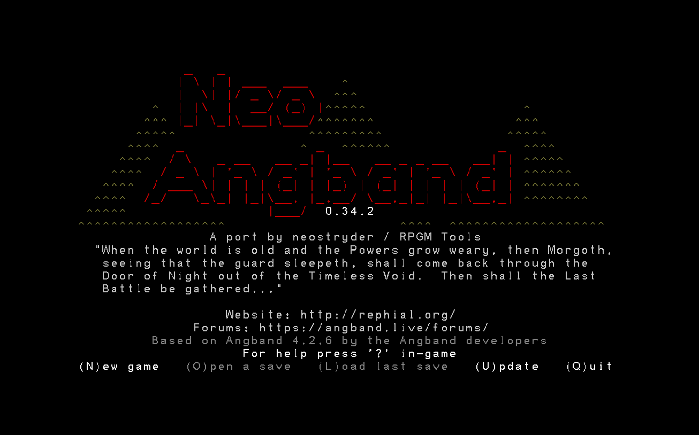

`(N)ew game` is what this guide follows. `(O)pen a save` and `(L)oad last save`
return to a character you already have; those only appear once one exists.

---

## 2. Roll a character

Pressing `N` starts the birth sequence: a series of menus, each one narrowing
down the character. `ESC` steps back a screen at any point if you change your
mind.

### Race

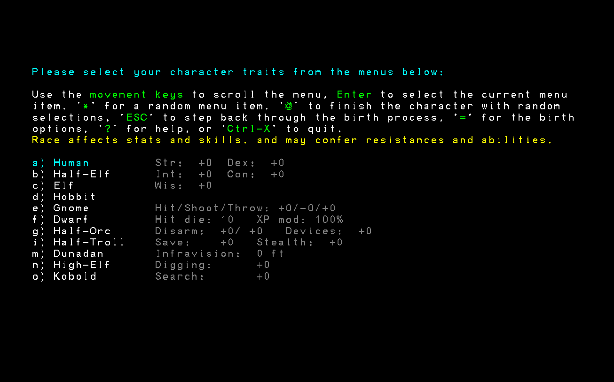

Race sets your starting stat bonuses, hit die, and any built-in resistances or
abilities. **Human** has no bonuses and no penalties - the plainest baseline, and
a reasonable pick for a first character since nothing about it needs explaining.
Every other race trades something for something: a Dwarf sees in the dark and
resists blindness but is slow to gain levels; a Hobbit is a poor fighter but
excellent at sneaking and saving throws.

### Class

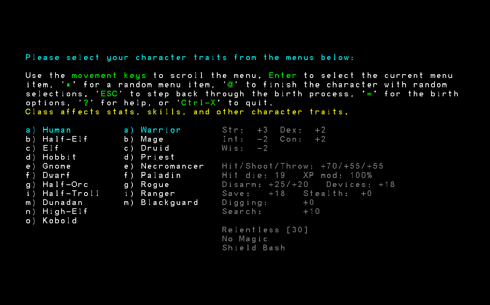

Class decides how the character plays: what it casts, if anything, and how it
fights. **Warrior** is the simplest starting point - no spells to learn, just
melee and equipment - which is why this walkthrough uses one. Every class has a
line at the bottom of this screen listing its most distinctive trait (a
Warrior's are `Relentless`, `No Magic`, and `Shield Bash`).

### How to generate stats

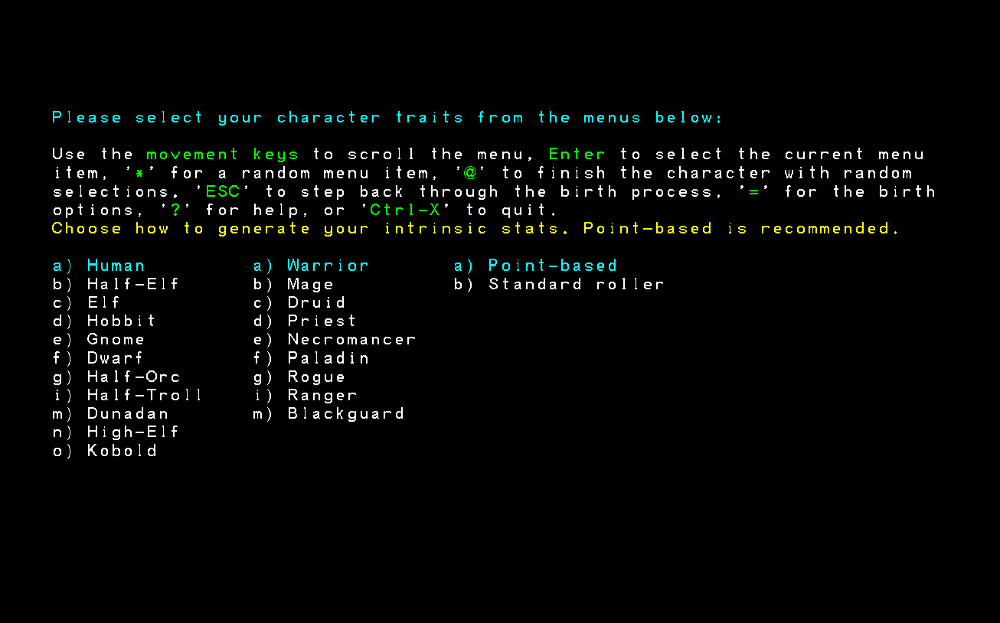

The game recommends **Point-based** right on this screen, and that recommendation
is worth taking for a first character: it hands you a fixed budget to spend
exactly where you want it, rather than rerolling dice and hoping. **Standard
roller** is the traditional random-and-reroll method upstream Angband also
offers, for anyone who wants it.

### Spending the points

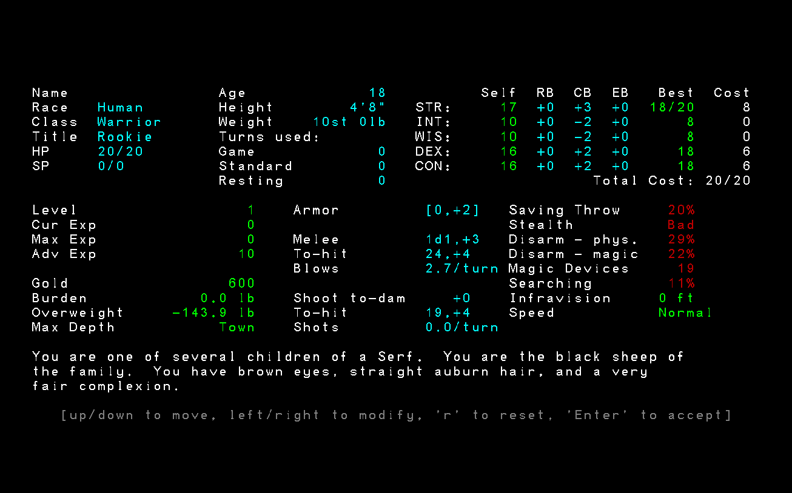

Up/down moves between stats, left/right raises or lowers the highlighted one, and
the screen updates every derived number live - hit points, to-hit, saving throw,
all of it - so the effect of a choice is visible before it is final. `r` resets
the spend and starts over. `Enter` accepts.

After stats, the game asks for a **name** (or `*` for a random one) and shows a
generated **character history** to accept or reroll. Accepting either drops the
character straight into the **town**, which is where play actually begins.

---

## 3. Basic controls

Movement is the arrow keys (or the numpad, which additionally gives the four
diagonals: `7 8 9` / `4  6` / `1 2 3`, with `5` for standing still a turn).
Walking into a wall does nothing but say so - `There is a wall in the way!` - so
there is no way to hurt a character by bumping into scenery.

The status line at the bottom of the screen names whatever the character is
currently standing on (`Open floor`, `Down staircase`, and so on), and the left
sidebar always shows the character's vitals: level, hit points, stats, gold. A
line of text ending in `-more-` means there is another message queued; any key
clears it.

**`Escape` opens the game menu** from anywhere in town or the dungeon - character
sheet, inventory, options, mods, graphics, and a full command reference all live
there, alongside `Save and exit`. **`?`** or, from that menu, **Help & keys**
opens an in-game command list if a specific key is ever in doubt. Neither
interrupts play; both return to exactly where the character was standing.

---

## 4. Game options

`=` opens the **Options Menu** directly, or reach it from the `Escape` menu.
**User interface options** is the one most worth a look on a first visit - it is
where things like automatic pickup, damage-to-monster display, and disturb
behaviour live, none of which change how the game plays, only how it is shown:

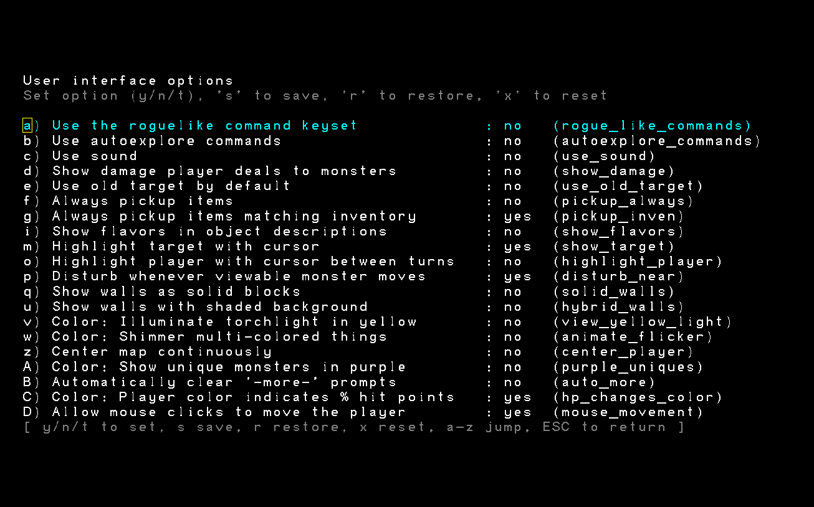

Each row is a `y`/`n`/`t` toggle; letters on the left jump straight to a row.
Nothing here needs to be touched to start playing - the defaults are upstream
Angband's own - but it is worth knowing this screen exists before three hours in,
not after.

---

## 5. Graphics: ASCII or tiles

`Escape` -> **Graphics** switches how the map is drawn. **ASCII is the default**
and is what the town screenshot above and the class-selection screens all show -
the traditional Angband look, and always available:

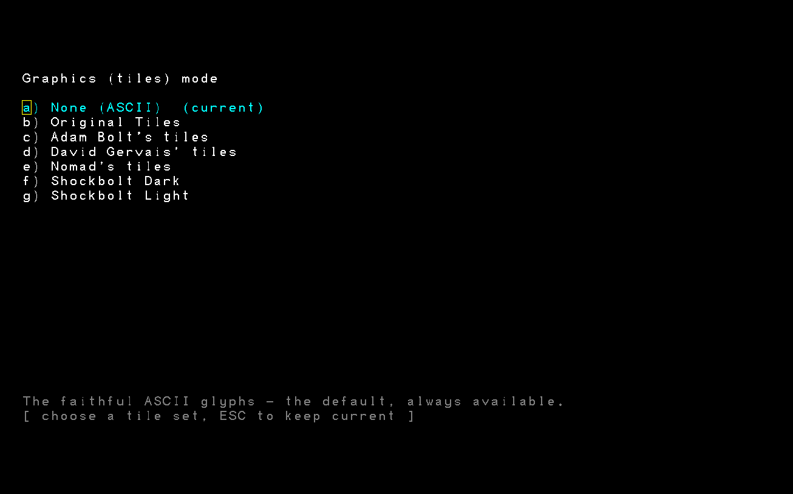

Every other row on that list is a built-in tile set - no mod required. **Shockbolt
Light** is a good one to try if ASCII is not to taste:

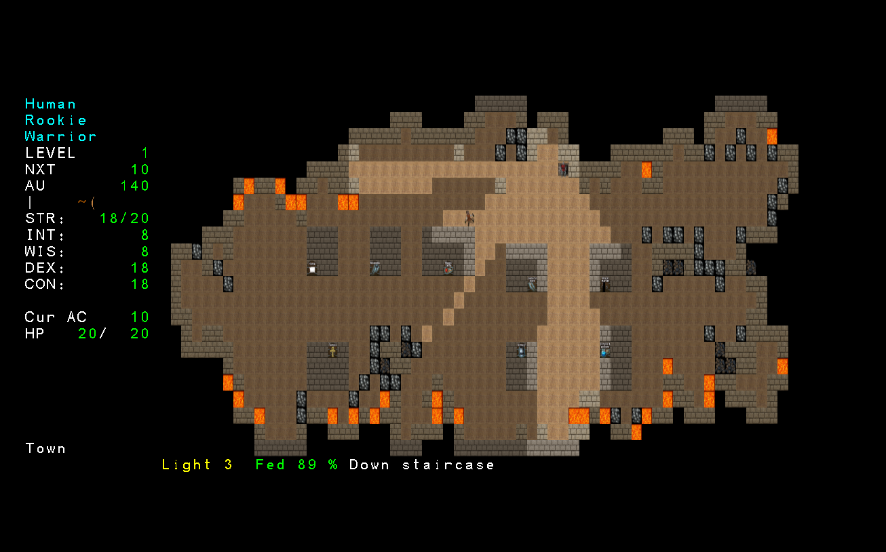

Switching tile sets does not change anything about the game itself, only how it
looks, and can be changed again at any time from the same menu.

---

## 6. Mods worth turning on

The game **ships with no mods installed at all** - a fresh copy is stock Angband,
faithfully, and stays that way until something is turned on deliberately.
`Escape` -> **Mods** -> **Install a mod...** -> **Recommended mods** shows the
curated list, downloaded live from each mod's own repository:

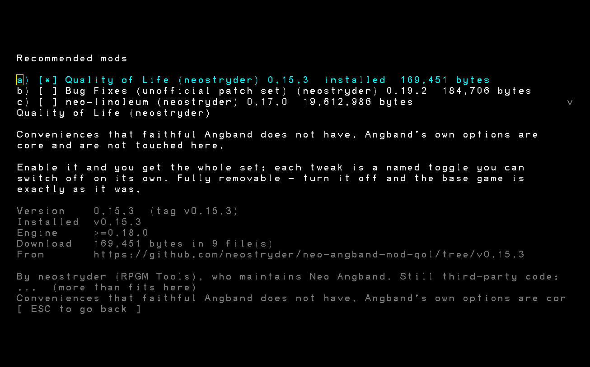

For a new player, two of these are the low-risk, high-value picks:

- **Quality of Life (`qol`)** adds conveniences the base game does not have at
  all - auto-digging through rubble and mineral veins while walking, and
  remembering a player's option choices from one character to the next instead of
  resetting them for every new life. Nothing here changes difficulty or balance.
- **Bug Fixes (`bug-fixes`)** opts into fixes for a short
  list of genuine upstream Angband defects that the base game deliberately keeps
  (to stay a faithful reproduction of the original). Things like a player-note
  truncation bug and a staircase that can occasionally generate unreachable.

Selecting one shows exactly what it changes and asks before turning it on -
nothing installs silently:

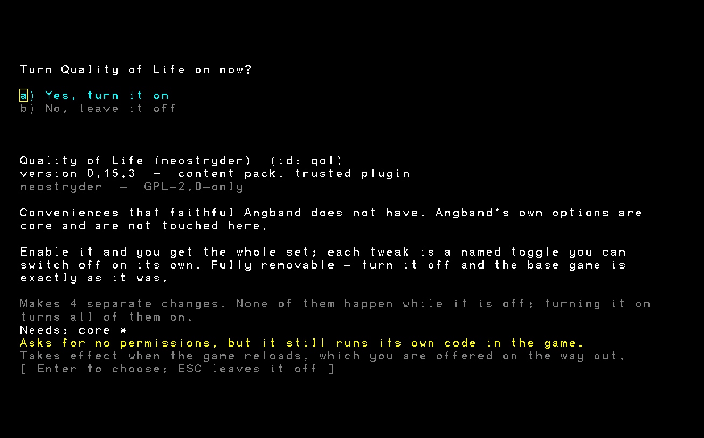

Both mods are fully reversible: every change they make is an individually named
toggle, so any one part of either can be switched back off without removing the
whole mod, and removing the mod entirely returns the game to stock behaviour
exactly. After installing, the **Mods** screen lists what is active:

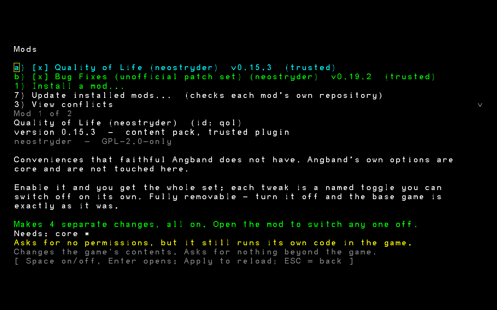

A new mod or a mod change takes effect on the game's next reload, which the
manager offers to do immediately.

---

## 7. A tour of town

Town is the hub between dungeon trips: gearing up, selling what was found, and
descending again. Each numbered entrance is a shop:

| # | Shop | What it is for |
| --- | --- | --- |
| 1 | General Store | Food, oil, torches, basic ammunition, digging tools - the first stop for any new character |
| 2 | Armoury | Armour of every kind |
| 3 | Weapon Smiths | Melee weapons, bows, and ammunition |
| 4 | Bookseller | Spellbooks, for classes that cast |
| 5 | Alchemy Shop | Potions and scrolls |
| 6 | Magic Shop | Wands, staves, rings, amulets |
| 7 | Black Market | Expensive, unpredictable, occasionally worth it |
| 8 | Home | Free storage - the only place besides worn/carried gear a character can keep things |

Walking onto a numbered entrance opens that shop. A starting Warrior's 600 gold
goes furthest at the General Store and the Armoury: a light source, some
phase-door scrolls, and basic armour cover most of what the first few dungeon
levels ask for.

---

## 8. Into the dungeon

Standing on the town's staircase (`>` glyph) and pressing `>` descends to dungeon
level 1. The game announces a **level feeling** as the floor is entered - a
first-impression hint about how dangerous or rewarding the level might be
("This seems a tame, sheltered place" is about as calm as it gets) - and then
hands control back:

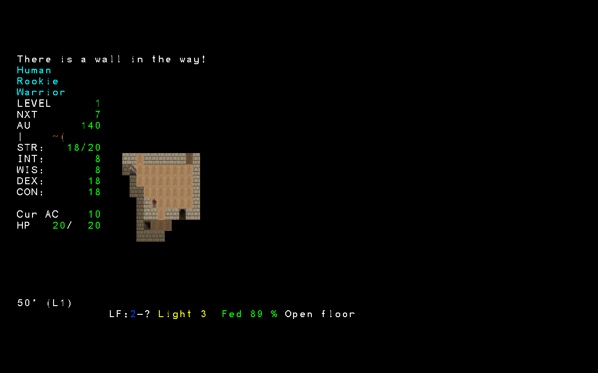

The sidebar and status line work exactly as they did in town. Corridors are
usually one tile wide and often force diagonal movement to follow them; a torch
lights only a few tiles around the character, so most of the level starts dark
and is revealed by walking through it. `<` on an up staircase and `>` on a down
one change levels; taking either regenerates the level on the way back, so
retracing steps never finds the exact same layout twice.

From here, the rest is Angband: explore, fight what can be handled, retreat from
what cannot, and come back to town to sell and restock. **Death is permanent** -
there is no built-in undo - so a character worth keeping is a character worth
backing up. `Shift-X` on the character list exports the highlighted character to
a file at any time; [INSTALL.md](INSTALL.md#what-destroys-a-roster) has the full
explanation of why that matters and what can and cannot be recovered from it.

---

## Where to go next

- **Something feels wrong or looks broken?** [Report it](../README.md#reporting-a-difference) -
  the parity target is the game with no mods enabled, so if `qol` or `bug-fixes`
  changed something on purpose, that is expected.
- **Want to change something yourself?**
  [Make a mod](modding/tutorials/README.md) starts from nothing and changes the
  game in about five minutes.
- **Stuck, or just want to ask someone?**
  [The RPGM Tools Discord](https://discord.gg/YegtwbHTBQ) - no GitHub account
  needed.
